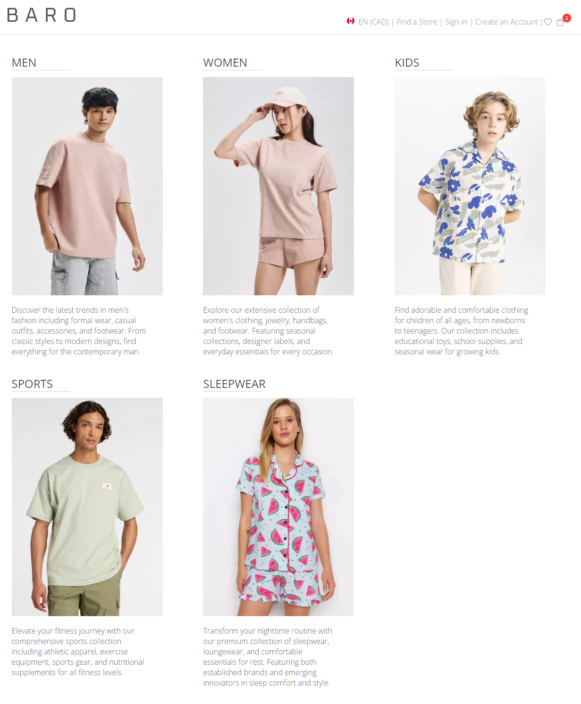
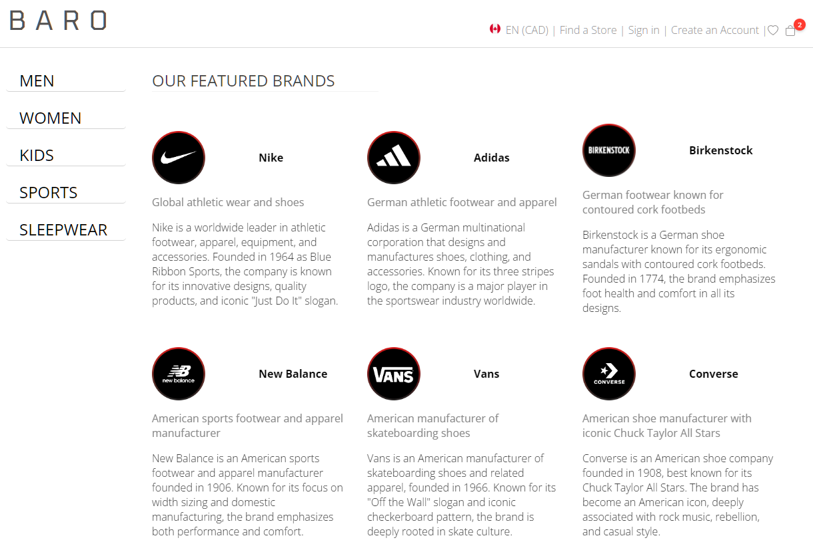

_This README.md file was created with assistance from AI - GitHub Copilot. 
The remaining code was developed without AI support, except where explicitly 
indicated in the code comments._

# Everyday Market App

A React-based e-commerce application showcasing fashion brands across different categories with shopping cart functionality.


## Project Overview

This project was built using **React 19.2** with **TypeScript**, **Vite**, and **React Router DOM**.

The Everyday Market App is a modern web application that displays merchandise organized by categories (Men, Women, Kids, Sports, Sleepwear) and brands. Users can browse categories, filter by brand, add items to cart, manage quantities, and view cart totals.


## Requirements

Before running this project, ensure you have the following installed:

- **Node.js**: v18.x or higher
- **npm**: v9.x or higher

## Features

- **Category Navigation**: Browse fashion items by category (Men, Women, Kids, Sports, Sleepwear)
- **Brand Filtering**: Filter merchandise by brand within each category
- **Shopping Cart**: Add items to cart with automatic quantity tracking
- **Cart Management**: View cart, adjust quantities, remove items
- **Async Service Layer**: Simulated API calls with loading states
- **Price Formatting**: Dollar and cents display with proper formatting
- **UPC Generation**: Unique 15-digit UPC codes with Luhn checksum validation
- **Component-Based Architecture**: Modular React components with TypeScript for type safety
- **Routing**: Multi-page navigation with React Router DOM
- **State Management**: Lifted cart state for persistence across routes

## Project Structure

```
src/
├── components/
│   ├── common/
│   │   └── header/             # App header with cart counter
│   └── market/
│       ├── brands/             # Brand display component
│       ├── category-menu/      # Category menu container
│       ├── category-menu-item/ # Individual category items
│       ├── products-page/      # Main landing page
│       ├── shop/               # Shop page with merchandise display
│       │   ├── shop.tsx        # Merchandise listing with filters
│       │   ├── cart.tsx        # Shopping cart view
│       │   └── cart.css
│       └── models/             # Data models and interfaces
│           └── merchandise.ts  # IMerchandise, ICartItem, merchandiseItems array
├── helpers/
│   ├── cart-helper.tsx         # Static cart UI components
│   ├── display-helper.ts       # Icons utility class
│   └── shop-service.ts         # ShopService with async filtering
├── App.tsx                     # Root component with routing
└── main.tsx                    # Entry point

public/
└── assets/
    └── images/              # Product images

screenshots/                 # Screenshots for this README
```

## Clone and Install (PowerShell)

Clone the repository and install dependencies:

```bash
git clone <repository-url>
cd react-everyday-market-app-extended
npm install
```


## Run the Development Server (PowerShell)

To start a local development server with Vite, run:

```bash
npm run dev
```

The app will be available at `http://localhost:5173/` (default Vite port).

## Build for Production

To build the project for production:

```bash
npm run build
```

To preview the production build locally:

```bash
npm run preview
```


## Screenshots

### Home Page - Category Selection


### Brand Display



## Components

### Products Page
- Main landing page displaying category menu
- Category selection with visual feedback and transitions
- Navigation to shop page with category and brand filters

### Category Menu
- Displays available product categories with images
- Supports category selection
- Implements collapse/expand functionality

### Category Menu Item
- Individual category item with collapsible styling
- Displays category name, image, and description
- Handles click events to collapse/expand menu
- CSS class transitions based on collapse state

### Brands (FilteredBrands)
- Displays brands filtered by selected category
- Grid layout with brand logos and descriptions
- Navigates to shop page with category and brand parameters on click
- Filters fashionBrands array by category type

### Shop Component
- Displays merchandise filtered by category and brand via URL params (`?cat=men&brand=Nike`)
- Uses ShopService for async data fetching with loading states
- Add to cart functionality with quantity tracking
- Prevents duplicate entries by incrementing quantity for existing items

### Cart Component (ViewCart)
- Displays cart items with UPC, brand, description, quantity
- Shows unit price and sub-total for each item
- Delete item functionality with quantity-based counter updates
- Auto-redirects to home when cart is empty (2-second delay)
- Uses static helper components for consistent UI

### Header Component
- App branding and navigation
- Cart counter badge (displays when cart has items)
- Logo click navigates to home page

## Helper Classes

### ShopService
- Async merchandise filtering with simulated 500ms API delay
- Promise-based getFilteredMerch(category, brand) method
- Uses helper functions for case-insensitive filtering

### CartDisplay (Static Components)
- `renderCartHeader()`: Renders cart table header
- `renderEmptyCartMessage()`: Displays empty cart state
- `deleteCartItem()`: Removes item and updates state

### Icons (Static Utility)
- SVG path constants for deleteIcon, shoppingCart, wishList
- Centralized icon management for consistent UI

## Utility Functions

### generateUPC(id: number)
- Creates consistent 15-digit UPC from merchandise ID
- Uses Luhn checksum algorithm for validation
- Returns formatted string with leading zeros

## Data Models

### Core Models
<details>

#### IMerchandise
Main product/merchandise interface
```typescript
interface IMerchandise {
  id: number
  brandName: string
  type: string
  item: string
  description: string
  price: number
  discount: number
  imageUrl?: string
}
```

#### ICartItem
Cart item extending merchandise with quantity tracking
```typescript
interface ICartItem extends IMerchandise {
  quantity?: number
}
```

#### ICategory
Product category definition
```typescript
interface ICategory {
  id: number
  name: string
  description: string
  longDescription: string
  imageUrl: string
}
```

#### IBrand
Fashion brand information
```typescript
interface IBrand {
  id: string
  name: string
  type: string[]           // Categories: men, women, kids, sports, sleepwear
  description: string
  longDescription: string
  imageUrl: string
  colors?: string[]
  sizes?: string[]
}
```
</details>

### Component Props Interfaces
<details>

#### IShopProps
Shop component cart state management
```typescript
interface IShopProps {
  cartCounter: number
  setCartCounter: (value: number | ((prev: number) => number)) => void
  cartItems: ICartItem[]
  setCartItems: (value: ICartItem[] | ((prev: ICartItem[]) => ICartItem[])) => void
}
```

#### ICartContents
Cart state management with React setter patterns
```typescript
interface ICartContents {
  id?: number
  cartCounter: number
  setCartCounter: (value: number | ((prev: number) => number)) => void
  cartItems: ICartItem[]
  setCartItems: (value: ICartItem[] | ((prev: ICartItem[]) => ICartItem[])) => void
}
```

#### ICategoryMenuProps
Category menu component props
```typescript
interface ICategoryMenuProps {
  isCollapsed: boolean
  onCollapseAll: (categoryName: string) => void
}
```

#### ICategoryItemProps
Individual category item props
```typescript
interface ICategoryItemProps {
  name: string
  imageUrl: string
  longDescription: string
  description: string
  isCollapsed: boolean
  onCollapseAll: (categoryName: string) => void
}
```

#### IFilteredBrandsProps
Brands display component props
```typescript
interface IFilteredBrandsProps {
  category: string
}
```

#### HeaderProps
Application header props
```typescript
interface HeaderProps {
  title: string
  cartCount?: number
}
```
</details>


### Service Interfaces
<details>
#### IShopService
Shop service filtering operations
```typescript
interface IShopService {
  getFilteredMerch(cat: string, brand: string): Promise<IMerchandise[]>
}
```
</details>

### Data Sets
- **105 merchandise items** across 6 types and 9 brands
- Types: men, women, kids, sports, sleepwear
- Brands: Nike, Adidas, Vans, Converse, Under Armour, New Balance, Puma, Birkenstock, Furla, Prada, Kate Spade, Calvin Klein, Victoria's Secret
- Each type has at least 5 brands with 4+ items per brand/type combination

## Testing

**Status**: Not implemented yet


<!-- Replace screenshots below with actual test results when tests are implemented -->


## License

This project is for educational purposes. The images and logos found on the pages belongs to their rightful owners 

## Contact

If you have questions or need further changes, reply here or refer to the course materials.